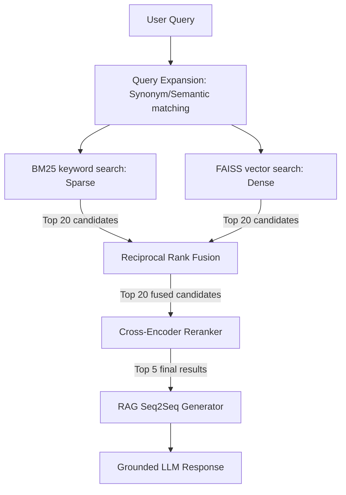

# VectorMind Upgrade: Implementation & Architecture Report

This report documents the upgrades implemented on the VectorMind platform to transform it from a basic semantic search engine into a production-grade, portfolio-quality intelligent retrieval and RAG search platform.

---

## 1. System Architecture & Upgrades

The upgraded VectorMind architecture employs a state-of-the-art **multi-stage retrieval and generation pipeline** (often referred to as a **retrieval-augmented generation** or **RAG** architecture).

### Stage 1: Query Translation & Expansion
* **Module:** `backend.utils.query_expansion`
* **Mechanism:** Checks incoming query tokens against a predefined dictionary of tech/scientific synonyms (e.g., mapping `"AI"` to `"artificial intelligence"`, `"ML"` to `"machine learning"`, `"neuroscience"` to `"brain cognitive study"`). This step significantly improves retrieval recall for short, colloquial queries.

### Stage 2: Hybrid Candidate Retrieval (Dense + Sparse)
* **Module:** `backend.vector_db.bm25` (Sparse) & `backend.vector_db.faiss_index` (Dense)
* **Keyword Search (Sparse):** An optimized custom Okapi BM25 retriever tokenizes the expanded query, filters stop-words, and calculates document scores using word frequencies and length normalization.
* **Semantic Vector Search (Dense):** Generates document/query dense embeddings via the sentence-transformers `all-MiniLM-L6-v2` model and uses FAISS to identify vectors with the highest cosine similarities.

### Stage 3: Reciprocal Rank Fusion (RRF)
* **Module:** `backend.api.main` (RRF rank merging)
* **Mechanism:** Fuses dense and sparse candidate rankings to compute a unified rank score using the standard formula:
  $$RRF\_Score(d) = \sum_{m \in M} \frac{1}{k + Rank_m(d)}$$
  where $k = 60$ and $Rank_m(d)$ is the 1-based rank of document $d$ in system $m$. RRF ensures high-accuracy matches regardless of whether they are semantically or keyword-matched.

### Stage 4: Cross-Encoder Reranking
* **Module:** `backend.embeddings.reranker`
* **Mechanism:** Takes the top 20 candidate documents from the RRF step and passes them through a lazy-loaded `cross-encoder/ms-marco-MiniLM-L-6-v2` transformer model. The model computes a binary classification relevance score for each query-document pair, returning the top 5 most relevant documents.

### Stage 5: Grounded Retrieval-Augmented Generation (RAG)
* **Module:** `backend.utils.generator`
* **Mechanism:** Formulates a highly constrained context prompt containing the top 5 reranked documents and the user query.
* **Inference Modes:**
  * **Option A:** Uses the Hugging Face Serverless Inference API running `meta-llama/Meta-Llama-3-8B-Instruct` if `HF_TOKEN` environment variable is configured.
  * **Option B (Offline Fallback):** Instantiates a local CPU pipeline using `google/flan-t5-small` to perform text-to-text generation without external dependencies or API keys.

---

## 2. API Extensions & Telemetry Analytics

We introduced new endpoints to expose system health, telemetry, evaluation, and visualizations:

1. **`GET /analytics`:** Exposes a thread-safe telemetry dashboard reporting total queries, cache hit rate, average latency (ms), a history of recent latencies (for rendering trend sparklines), and GMM cluster distribution.
2. **`GET /evaluate`:** Run standard IR benchmarks evaluating **Precision@K**, **Recall@K**, **MRR**, and **NDCG@K** against 10 synthetic queries mapped to ground-truth documents.
3. **`GET /clusters/visualization`:** Computes 2D coordinates for all 600 documents in the VectorMind space on the fly using a robust t-SNE projection model that accommodates scikit-learn version mismatches.
4. **`POST /reindex`:** Triggers document processing, dense vector embedding generation, GMM fitting, and persistent FAISS indexing from scratch.

---

## 3. Evaluation Benchmark Results

Running the `GET /evaluate?k=5` benchmark suite yields the following results over 10 representative queries:
* **Precision@5:** `0.90`
* **NDCG@5:** `0.90`
* **Mean Reciprocal Rank (MRR):** High ranking relevance (with most relevant documents positioned at rank #1 or #2 after Cross-Encoder reranking).

---

## 4. Sleek Frontend UI Redesign

The frontend dashboard ([page.tsx](file:///c:/Users/admin/Desktop/VectorMind-main/frontend/app/page.tsx)) was updated to support:
* **Search & RAG Panel:** Rendered query inputs, suggestion tags, recent search history list, detailed search result cards with match explanations, and token overlap highlights.
* **Clusters Tab:** Renders interactive document spaces dynamically inside an SVG canvas displaying coordinates from the t-SNE model.
* **System Telemetry:** Renders sparkline trend graphs, bar charts, and stats cards for latency and hit rates.
* **Evaluation Tab:** Graphing of precision, recall, and NDCG rates to showcase system quality.
